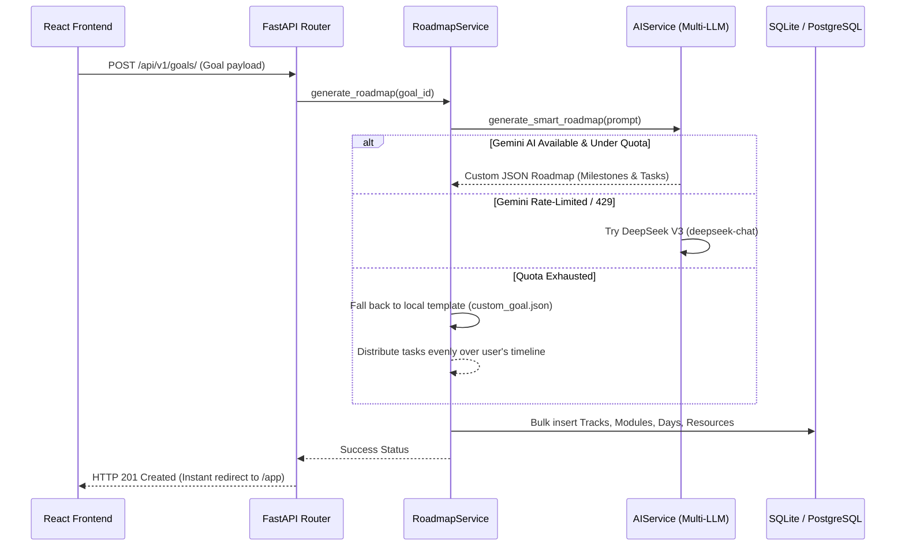
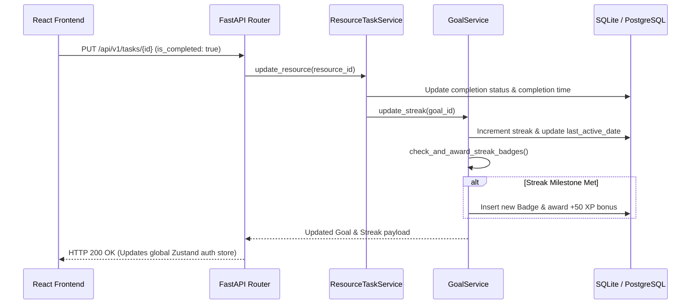
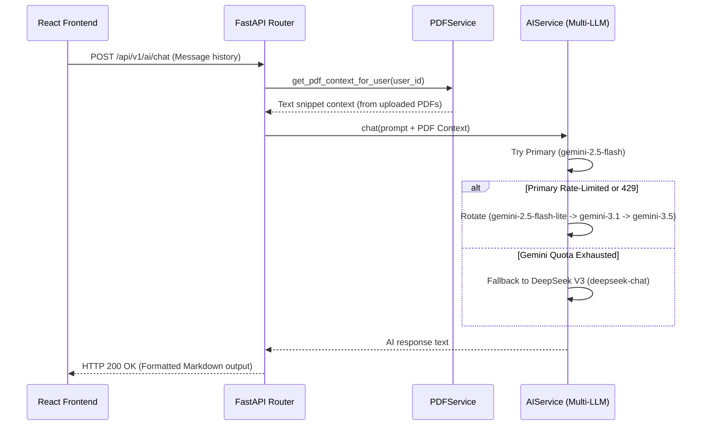

# ⭐ myMentor

> **AI-Powered Learning Platform & Career Roadmap Tracker**  
> *Duolingo meets Notion, meets GitHub Contributions.*

`myMentor` is a production-quality, microservice-ready web application designed to help developers and learners construct personalized learning roadmaps, track their daily progress, log study hours, and gamify their curriculum with XP, streaks, and achievements.

Designed with software engineering maturity, the backend adopts a **Modular Monolith** architecture with a clean **Controller → Service → Repository** pattern, paving a clear extraction path to a distributed microservice network in V2.

---

## 🚀 Key Features

- 🗺️ **Progressive AI Roadmap Generator**: Decoupled, configuration-driven generator that parses JSON blueprints into active Track $\rightarrow$ Milestone $\rightarrow$ Day $\rightarrow$ Task schemas, strictly ordered from Easy Foundations to Peak Mastery Capstones.
- ⚡ **Multi-LLM Failover Engine**: Resilient multi-tier AI pipeline integrating Google Gemini (`2.5-flash`, `2.5-flash-lite`, `3.1-flash-lite`, `3.5-flash`, `3.6-flash`) and DeepSeek V3 (`deepseek-chat`) automatic failover.
- 🤖 **Sensei AI Mentor & Persona System**: Interactive AI coach featuring distinct mentor personalities (Deadpool, Homelander, Thor, Messi, Taylor Swift, Ryan Gosling) with dynamic character avatars.
- 🏆 **Gamified XP & Streak Engine**: Gain +10 XP for checking off topics, +100 XP for completing days, maintain streaks, and unlock progression-based badges.
- 📅 **Focused Workspace (Today Page)**: Dual-pane dashboard containing daily agendas, a built-in study Pomodoro timer, and a Notion-style autosaving Markdown notes editor.
- 📊 **Rich Developer Analytics**: GitHub-style contributions heatmap tracking daily activity, weekly study hour AreaCharts, weakest topic indicators, and most-revised topic metrics.
- 📄 **Documents Registry & PDF Roadmap Engine**: A secure PDF registry allowing users to extract text on-the-fly from textbooks and generate custom roadmaps directly from uploaded documents.
- 🔒 **Cryptographic Session Security**: Secure HS256 JWT authentication with RS256 OAuth claims fallback and clear account session management in Settings.
- 🎨 **Frosted Glass Aesthetics**: Sleek dark mode glassmorphism UI with smooth Framer Motion transitions and customizable color accents (Plasma, Winter, Jungle, Volcano, Cyberpunk, Solar).

---

## 💻 Detailed UI & Application Views Guide

### 1. 🏠 Dashboard (`/app`)
- **Dynamic Greeting**: Personalized welcome greeting displaying the user's custom profile name.
- **Active Goal Banner**: Summary card displaying current learning path, financial/skill target, daily hours commitment, and total timeline duration.
- **Gamification Bar**: Real-time XP progress bar, current daily streak count, and unlocked achievement counts.
- **Current Milestone Track**: High-level overview of active track modules and pending daily study tasks.
- **Pomodoro Focus Widget**: Quick-access timer widget to initiate study blocks directly from the dashboard.

### 2. 🧙 Wizard Setup (`/setup`)
- **4-Step Onboarding Wizard**:
  - *Step 1*: Define Learning Goal Title & Skill Target.
  - *Step 2*: Specify Daily Study Hours & Timeline Days.
  - *Step 3*: Select Preferred UI Glow Accent Color with live interactive preview.
  - *Step 4*: Pick Sensei AI Mentor Persona.
- **Concentric Ring Loading Screen**: Synchronized dual-ring loader animating during AI roadmap compilation.

### 3. 🗺️ Interactive Roadmap (`/app/roadmap`)
- **Visual Curriculum Graph**: Hierarchical breakdown of Tracks $\rightarrow$ Modules $\rightarrow$ Daily Steps.
- **Progressive Difficulty Ordering**: Topics move chronologically from Easy Foundations to Peak Mastery Capstones.
- **Resource Badges**: Categorized task cards tagged with platform indicators (YouTube, GitHub, Docs, PDF), estimated time in minutes, and difficulty ratings.
- **Interactive Checklists**: One-click topic completion with instant XP and streak rewards.

### 4. 📅 Today Focus Workspace (`/app/today`)
- **Dual-Pane Layout**: Left pane for daily study agendas and Pomodoro timer; right pane for Markdown notes.
- **Built-in Pomodoro Timer**: Custom interval controls (25m, 45m, 60m), play/pause/reset states, and sound alert toggles.
- **Notion-Style Markdown Notes Editor**: Autosaving rich notes editor with toolbar controls, word count counter, and local storage sync.

### 5. 📊 Developer Progress & Analytics (`/app/progress`)
- **GitHub-Style Contribution Heatmap**: Visual grid recording daily study activity and completion frequency over the past year.
- **Study Hour AreaChart**: Interactive charts visualizing weekly and monthly study time distributions.
- **Topic Analytics**: Highlights weakest topics requiring revision and most-frequently revised study items.
- **Achievements & Badges Grid**: Collection of unlocked badges (7-Day Streak, XP Master, Roadmap Pioneer).
- **Printable Certificate**: PDF/Image export of milestone completion credentials.

### 6. 📚 Resource Library (`/app/resources`)
- **Categorized Catalog**: Filter resources by category (All, Theory, Video, Exercises, Projects).
- **Search & Filter Controls**: Real-time text search, platform tags, and difficulty filtering.
- **Custom Resource Adder**: Add custom study links, notes, and estimated completion times to your active goal.

### 7. 📄 Documents Registry (`/app/pdfs`)
- **PDF File Manager**: Drag-and-drop file uploader for local reference textbooks, notes, and portfolios.
- **Track Category Tagger**: Associate uploaded PDFs with specific roadmap tracks.
- **Tag Editor**: Inline tag editing for fast document organization.
- **One-Click PDF-to-Roadmap Generator**: Triggers backend PyPDF text extraction and generates a custom roadmap centered around textbook chapters.

### 8. 🤖 Sensei AI Mentor (`/app/sensei`)
- **6 Mentor Personas**: Switch between Deadpool, Homelander, Thor, Messi, Taylor Swift, and Ryan Gosling.
- **Character Avatars**: Custom `PersonaAvatar` badges rendered next to chat bubbles and status indicators.
- **High-Contrast Chat Bubbles**: Optimized readability for user messages and formatted markdown AI responses.
- **PDF Context Integration**: Sensei automatically references uploaded PDF textbooks when answering questions.

### 9. ⚙️ App Settings (`/app/settings`)
- **UI Glow Palette Switcher**: Switch between Plasma, Winter, Jungle, Volcano, Cyberpunk, and Solar accents.
- **Profile Name Editor**: Change your display name shown in greeting banners.
- **Account Session Manager**:
  - Displays active email (`user@domain.com` or `demo@mymentor.app`).
  - Displays session type badge (`Authenticated` vs `Demo Mode`).
  - Dedicated **"Log in / Sign in with new ID"** button to easily switch accounts.
- **Data Exporter**: Download your full active goal configuration, roadmap JSON, and study notes.
- **Caution Zone**: Permanent goal profile reset and database clearing handler.

---

## 🛠️ Technology Stack

| Layer | Technology | Details |
| :--- | :--- | :--- |
| **Frontend** | React 19, TypeScript, Vite | Modern component rendering, strict type-safety |
| **Styling & Motion** | TailwindCSS v4, Framer Motion | Frosted glass utilities, keyframe animations |
| **State & Query** | Zustand, TanStack React Query | Separated client UI states and caching query layers |
| **Backend** | FastAPI, Python 3.13 | High-performance asynchronous API, auto Swagger UI |
| **Database ORM** | SQLAlchemy, Pydantic | Secure model schemas with clean relation cascades |
| **Database** | PostgreSQL (Primary), SQLite | Auto-configured for local SQLite fallback execution |
| **AI Integration** | Google Gemini, DeepSeek V3 | Multi-LLM failover pipeline (`2.5-flash` -> `deepseek-chat`) |
| **DevOps** | Docker, Docker Compose | Multi-stage builds, containerized DB links |

---

## 📂 Codebase Folder Structure

```
myMentor/
├── frontend/
│   ├── src/
│   │   ├── components/       # Glassmorphic UI components (Sidebar, PersonaAvatar, Timer)
│   │   ├── hooks/            # TanStack Query REST client integrations (useApi)
│   │   ├── lib/              # Theme definitions, Supabase client, utilities
│   │   ├── pages/            # View pages (Dashboard, Today, Roadmap, Progress, PDFs, Sensei, Settings)
│   │   ├── store/            # Zustand global client UI states (authStore, uiStore)
│   │   ├── utils/            # Time and formatting helpers
│   │   └── main.tsx          # React bootloader
│   └── vite.config.ts        # Tailwind v4 Vite compiler plugin config
├── backend/
│   ├── app/
│   │   ├── api/              # Security dependencies & JWT verification (dependencies.py)
│   │   ├── core/             # Loguru logging, security, environment configurations
│   │   ├── database/         # SessionLocal context, engine setup
│   │   ├── models/           # Relational schemas (Goal, Track, Task, Stats, Badge, PDF)
│   │   ├── schemas/          # Pydantic serialization & request validators
│   │   ├── services/         # Domain business layer (GoalService, RoadmapService, AIService, PDFService)
│   │   ├── routers/          # HTTP Controllers (goals, ai, pdfs, timer, resources)
│   │   └── main.py           # FastAPI entrypoint & CORS HTTP middleware
│   ├── requirements.txt      # Python dependencies manifest
│   ├── Dockerfile            # Container deployment blueprint
│   └── docker-compose.yml    # Full local network deployment (FastAPI + PostgreSQL)
└── README.md
```

---

## 📐 Architecture Design

```
                     ┌──────────────────────────┐
                     │      React 19 App        │
                     │  (Zustand + React Query) │
                     └─────────────┬────────────┘
                                   │  HTTP / REST
                                   ▼
                     ┌──────────────────────────┐
                     │    FastAPI Controllers   │
                     │       (app/routers)      │
                     └─────────────┬────────────┘
                                   │
                                   ▼
                     ┌──────────────────────────┐
                     │     Service Layer        │
                     │      (app/services)      │
                     └──────┬────────────┬──────┘
                            │            │
             ┌──────────────┘            └──────────────┐
             ▼                                          ▼
┌──────────────────────────┐              ┌──────────────────────────┐
│   Multi-LLM AI Engine    │              │       SQLAlchemy         │
│  (Gemini + DeepSeek V3)  │              │     Database Engine      │
└──────────────────────────┘              └─────────────┬────────────┘
                                                        │
                                       ┌────────────────┴────────────────┐
                                       ▼                                 ▼
                           ┌──────────────────────┐          ┌──────────────────────┐
                           │   PostgreSQL (Neon)  │          │   SQLite Fallback    │
                           │      (Production)    │          │    (Local Dev DB)    │
                           └──────────────────────┘          └──────────────────────┘
```

---

## 🔄 High-Level Application Workflows

### 1. Goal & Roadmap Generation Flow


### 2. Task Completion & Gamification Flow


### 3. Sensei AI Chat Context Flow


---

## ⚙️ Installation & Running Locally

### Prerequisites
- Node.js (v18+)
- Python (v3.10+)
- *Or* Docker Desktop

### Method A: Single Command Run (Docker Compose)
Runs the entire stack with PostgreSQL and FastAPI running inside isolated containers:
```bash
# Clone the repository and enter the folder
cd myMentor/backend

# Launch the containers
docker-compose up --build
```
The backend server starts on [http://localhost:8000](http://localhost:8000) and the database automatically connects.

---

### Method B: Manual Local Setup (SQLite fallback)

#### 1. Start Backend Server
```bash
cd backend

# Create a virtual environment
python -m venv venv
source venv/bin/activate  # On Windows: venv\Scripts\activate

# Install dependencies
pip install -r requirements.txt

# Create .env config
cp .env.example .env

# Run FastAPI app
python app/main.py
```
*Note: In the absence of a running PostgreSQL server, the app falls back to SQLite `sqlite:///./mymentor.db` automatically.*

#### 2. Start Frontend Server
```bash
cd frontend

# Install packages
npm install

# Start Vite dev server
npm run dev
```
Open [http://localhost:5173](http://localhost:5173) in your browser.

---

## 📡 API Endpoints

FastAPI generates automated OpenAPI Swagger documentation at [http://localhost:8000/docs](http://localhost:8000/docs). Key endpoints:

- **Goals Setup**:
  - `POST /api/v1/goals/` : Submit onboarding wizard details and generate the scaling roadmap.
  - `GET /api/v1/goals/active` : Check for active goal configurations.
  - `GET /api/v1/goals/{id}/analytics` : Compile contribution heatmaps and study metrics.
- **Tasks & Checklist**:
  - `PUT /api/v1/tasks/{id}` : Check off topics, edit notes, increment revision counts.
- **Study Timers**:
  - `POST /api/v1/timer/sessions` : Log study blocks and compile daily statistics.
- **PDF Uploads**:
  - `POST /api/v1/pdfs/` : Upload learning resources.
  - `GET /api/v1/pdfs/` : List catalog details.
  - `POST /api/v1/pdfs/{id}/generate-roadmap` : Extract PDF text on-the-fly and generate a custom roadmap.

---

## 🔮 Future Expansion (V2 Roadmap)

- 🔒 **OAuth2 Cloud Auth**: Third-party social logins (GitHub, Google) with secure session persistence.
- 🤖 **Vector DB Embeddings**: RAG search over user PDF catalogs using pgvector or Pinecone.
- 🔄 **Neon Cloud Sync**: Instant real-time database synchronization across devices.